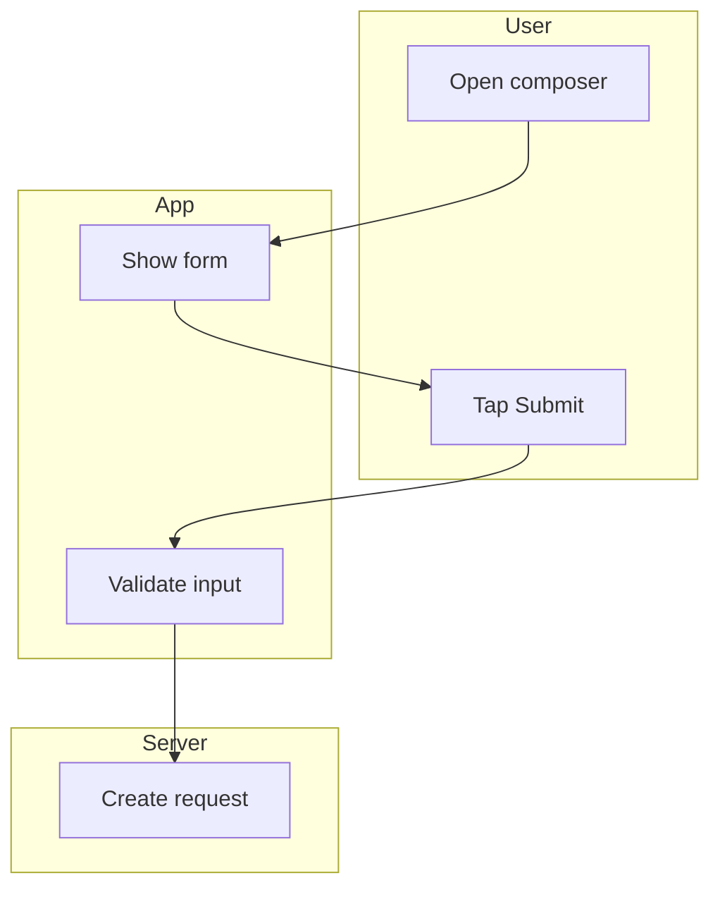
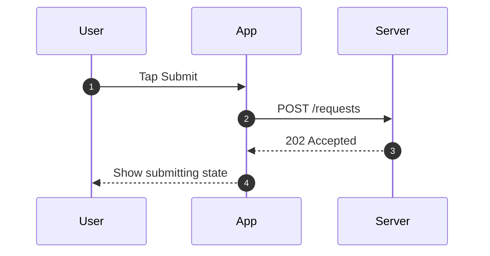

# Flow Rules

Use this file before writing Mermaid.

## Diagram Types

Use only two default diagram types:

- Swimlane flowchart
- Sequence diagram

Do not try to emulate full BPMN.

## Swimlane Rules

### Syntax

Use `flowchart TD` plus `subgraph` for lanes.

### Lane Order

Prefer this order:

1. `User`
2. `App`
3. `Server`
4. `Operator`
5. `AI`

Drop lanes that do not matter for the current flow. Do not keep empty lanes.

### Node Rules

- Give every node a stable ID.
- Keep node labels action-oriented.
- Prefer `verb + object`.
- Keep one user-visible or system-visible action per node.

### Edge Rules

- Use unlabeled edges for the default path.
- Label edges only when the branch meaning matters.
- Split exception-heavy logic into a second diagram instead of creating one unreadable chart.

### Coverage

Each primary swimlane should expose:

- trigger
- main path
- critical branch or failure path
- completion state
- manual or AI handoff where relevant

## Sequence Rules

### Syntax

Use `sequenceDiagram`.

### Message Types

Map the schema message types to Mermaid arrows like this:

- `request` -> `->>`
- `response` -> `-->>`
- `async` -> `-)`
- `error` -> `--x`
- `return` -> `-->>`

### Coverage

Use sequence diagrams for:

- API request and response timing
- AI request and fallback timing
- async handoff
- timeout and retry handling

If timeout and success make the same diagram unreadable, split them.

## Notes and Captions

In `03-flows.md`, each diagram needs:

- a one-line purpose
- scope or trigger
- known gaps

Do not leave Mermaid code without explanation.

## Example Swimlane

## Example Sequence

